# Solar MPPT Charge Controller

Wondered what goes into Solar charge controllers? And what makes MPPT better than any of the others? Find out yourself, by making this Solar MPPT Charge Controller project. Uses a simple Arduino Nano to control and regulate the flow of power from the panel to the battery, and has a output relay to automatically turn off when the Battery gets too low.
A great project for DIY amatures and solar aficionados.

## Before you begin

While we take care in information and our projects, we do not guarantee the suitability as a proper MPPT charge controller for your application. If you want or need an MPPT charge controller, we highly recommend you talk to one of our staff about purchasing one to fit your needs.
This project is presented as a way of demonstration and design of a solar MPPT charge controller project, Risks in assembly and use are for you to understand and we take no responsibility for damaged batteries or panels. If you do not understand the risks, do not attempt.

- [Solar MPPT Charge Controller](#Solar-MPPT-Charge-Controller)
  - [Before you begin](#Before-you-begin)
  - [Bill of Materials](#Bill-of-Materials)
  - [Prior knowledge](#Prior-knowledge)
  - [Connection Diagram](#Connection-Diagram)
  - [Assembly Instructions](#Assembly-Instructions)
    - [Lid assembly](#Lid-assembly)
    - [Circuit board layout](#Circuit-board-layout)
  - [Program](#Program)
  - [Use](#Use)
    - [Need more info](#Need-more-info)
  
## Bill of Materials

|  Qty | Code                                     | Description             |
| ---: | ---------------------------------------- | ----------------------- |
|    1 | [XC4414](https://jaycar.com.au/p/XC4414) | Arduino Nano            |
|    1 | [ZT2467](https://jaycar.com.au/p/ZT2467) | IRF9540N P-Ch mosfet    |
|    1 | [ZT2152](https://jaycar.com.au/p/ZT2152) | BC547 NPN Transistor    |
|    1 | [RE6330](https://jaycar.com.au/p/RE6330) | 2200uF Cap              |
|    1 | [LF1270](https://jaycar.com.au/p/LF1270) | 100uH 5A Choke          |
|    1 | [HM3230](https://jaycar.com.au/p/HM3230) | 40 pin female header    |
|    1 | [HP9550](https://jaycar.com.au/p/HP9550) | Prepunched PCB          |
|    1 | [XC4419](https://jaycar.com.au/p/XC4419) | Relay board module      |
|    1 | [QP5521](https://jaycar.com.au/p/QP5521) | LCD with backlight      |
|    1 | [SR1230](https://jaycar.com.au/p/SR1230) | Rotary encoder          |
|    1 | [HH8503](https://jaycar.com.au/p/HH8503) | TO220 clipon heatsink   |
|    1 | [HM3168](https://jaycar.com.au/p/HM3168) | 6Way Terminal Barrier   |
|    1 | [HM3418](https://jaycar.com.au/p/HM3418) | Header Pins             |
|    1 | [HM3408](https://jaycar.com.au/p/HM3408) | Header Sockets          |
|    1 | [RC5360](https://jaycar.com.au/p/RC5360) | Ceramic Cap 100nF       |
|    1 | [RG5065](https://jaycar.com.au/p/RG5065) | Greencap 10nF           |
|    1 | [RR0596](https://jaycar.com.au/p/RR0596) | 10k Resistor            |
|    1 | [RR0619](https://jaycar.com.au/p/RR0619) | 91k Resistor            |
|    1 | [RR0644](https://jaycar.com.au/p/RR0644) | 1M0 Resistor            |
|    2 | [HM3172](https://jaycar.com.au/p/HM3172) | PCB Terminal 2way       |
|    2 | [ZR1039](https://jaycar.com.au/p/ZR1039) | Rectifier MBR20100CT    |
|    1 | [HB6011](https://jaycar.com.au/p/HB6011) | Enclosure               |
|    1 | [XC3706](https://jaycar.com.au/p/XC3706) | I2C LCD Port Expander   |
|    1 | [XC4514](https://jaycar.com.au/p/XC4514) | DC-DC Voltage Regulator |
|    1 | [XC4610](https://jaycar.com.au/p/XC4610) | Current Sensing Module  |

## Prior knowledge

The general operation of MPPT Solar Charge Controllers is to pulse width modulate the power coming from the Solar panel into the battery, measuring the voltage and current of what's flowing through the system as a whole and attempting to find the maximum power point transfer (hence the name) between the PWM, Voltage, and Current.

Realistically it is an easy process to understand, and can be broken down into simple PSEUDOCODE:

```plaintext
A: some small portion or step to take in PWM signals; could be 1%
loop:

    PWM the power to battery
    measure voltage and current to find wattage;

    is wattage higher than the last wattage reading?
        yes:
            #( we are going in the right direction, keep going)
            change PWM signal by amount "A"
        no:
            #( we have decreased power, so change A to be the opposite value)
            let A = -A
            change PWM signal by amount "A" #(which is now -A)

        equal:
            #they are equal, so do nothing; this is the MPPT

    let last wattage reading = this wattage reading

endloop
```

This is a simple loop but should suffice in understanding of how the structure of MPPT works; PWM the signal and measure the effects.

Everything else to this project; the screen, relay, encoders; are all 'nice to haves' but aren't needed for the MPPT functionality; infact you could probably get by with just a few components for this project.

## Connection Diagram

There's one main diagram here, which will need explaining:

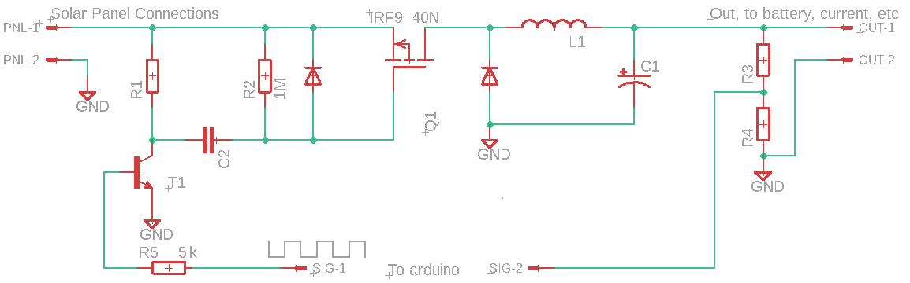

Starting from the left solar panel connectors, we designate positive and negative as connections one and two from `PNL` which connects straight to the `source` pin of our mosfet; the `IRF9540N`.

The IRF9540N (we'll just 'IRF' for short) is the heart of this project; Which is why we cover it with a heat-sink. The core amount of power will be flowing through the mosfet depending on the signal from the arduino nano.

Our `SIG-1` from the arduino is the square wave, flowing into our BC547 transistor via 5K resistor ( We can just use 2x 10k resistors in parallel); this is used to amplify the signal from the arduino flowing into the mosfet;

In our case; if you look at the [IRF Datasheet](https://www.jaycar.com.au/medias/sys_master/images/9238752755742/ZT2467-dataSheetMain.pdf) you will find the `Gate threshold voltage` to be between -2 and -4 volts (note the minus); theoretically, "at a voltage between -2 and -4" with respect to the source, the gate will drop and the mosfet will begin to "turn on" and allow current to pass though (onwards to the battery).

We don't have a -2 to -4 volt source; we do have a 5v square wave and a capacitor, which will have to do. If we charge up a capacitor, once the capacitor is charged at 5V, dropping to 0 will induce a negative voltage.

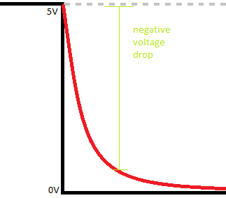
*simplified explaination*

The only issue with this, from initial testing, was that it was not dropping fast enough and there wasn't a big enough "negative voltage" present on the gate of the mosfetto turn it on fully ( remember that -4 is the maximum voltage to START to conduct; consider it like a standard tap; you can slowly turn it on to START to drip; we wanted a bath-tub a minute..) - the BJT comes to the rescue.

Instead of simply charging the capacitor to 5V from the arduino, the signal through the BJT gets amplified to some higher amount;then drops it just as fast, whipping the mosfet into action so that it can operate at full saturation and allow all the power to come through ( and to turn off when we want it to turn off). Observing this on a oscilliscope saved our bacon and allowed us to watch it behave correctly, before we continue to build.

Only other mentions on the `GATE` side of the mosfet is the use of the 1M resistor ( to 'tie' the gate to source voltage; The gate needs to operate with respect to the source, so instead of the capacitor only changing between 0-5, it's actually operating at 23v-18v, which is the -5v difference needed to turn on the gate; play around on [falstad](https://www.falstad.com/circuit/circuitjs.html?cct=$+1+0.000005+38.696464541249114+48+5+43%0Av+16+320+16+64+0+0+40+23+0+0+0.5%0Af+272+160+272+64+41+5+0.02%0Ar+176+64+176+160+0+1000000%0Aw+256+64+224+64+0%0Aw+16+64+176+64+0%0Ac+112+160+176+160+0+0.000009999999999999999+-15.55498776062019%0Aw+224+160+272+160+0%0Ar+384+64+384+320+0+1000%0Aw+128+320+384+320+0%0Aw+288+64+384+64+0%0Av+128+320+128+208+0+0+40+5+0+0+0.5%0Aw+96+320+96+208+0%0AS+112+160+112+208+0+0+false+0+2%0Aw+16+320+96+320+0%0Aw+128+320+96+320+0%0Ad+224+160+224+64+2+default%0Aw+176+64+224+64+0%0Aw+176+160+224+160+0%0A403+160+208+288+272+0+5_64_0_4099_20_0.00009765625_1_2_5_3%0Ao+7+64+0+4099+0.00244140625+0.00009765625+0+2+7+3%0A) if you're not sure)

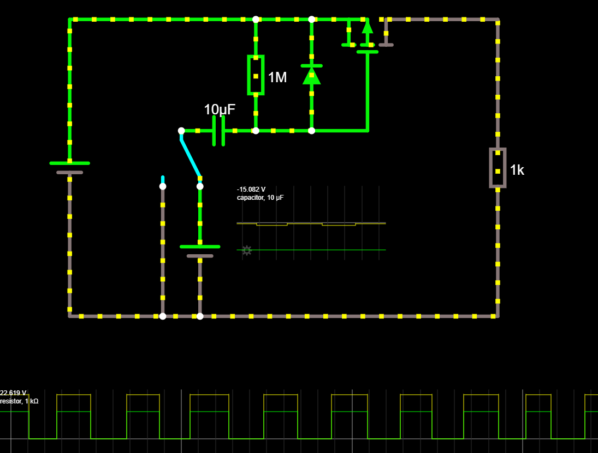

Then from the source to the drain of the mosfet, we output via an inductor (or Choke) and capacitor to give us smoother experiences on the battery side of things; There is a protection diode between the choke and the Mosefet so there is no harsh EMF voltage from the coil, and we have the final voltage measurement (through the voltage divider) and current measurement ( present on the battery terminals; see assembly instructions for positioning.) which gives us the power output from the system.

From that, there's the simplier connections below:

| Nano Connection | Pin             | Product               | Description                 |
| --------------- | --------------- | --------------------- | --------------------------- |
| A0              | Voltage divider |                       | Voltage output from MOSFET  |
| A1              | Current output  | XC4610 Current Sensor | Current output from MOSFET  |
| A2              | Encoder A       | SR1230 Rotary Encoder | Encoder 'A' click           |
| A3              | Encoder B       | SR1230 Rotary Encoder | Encoder 'B' click           |
| A4              | SDA             | I2C Port Expander     | Data signal going to screen |
| A5              | SCL             | I2C Port Expander     | Clock signal to screen      |
| A6              | Relay Signal    | XC4419 Relay Module   | Activate relay when enabled |
| A7              | Encoder Button  | SR1230 Rotary Encoder | Button on encoder           |

There is also a voltage regulator to power the arduino.

To make things easier, the relay, voltage regulator, current sensor, screen and encoder are all going onto the 'lid' of the HB6011 enclosure, which means we will have to use wires going between the 8 pin connectors to connect the functions of the lid to the main board.

The relay is used to controll power going to the load, allowing you to shut off when there's no daylight, or otherwise.


## Assembly Instructions

### Lid assembly

Making the lid assembly is fairly easy to do, with the main difficulty in being cutting out a panel for the screen. The size of the LCD is 24x71 (mm), which comes to about 2.5 squares high, and 7 squares long. Get the general size first, before checking to fit, and file out as needed, as you don't want to make the hole too big.

Make sure the position of the cutout is far enough in from the edge to allow room for the LCD circuit board. We put our LCD cutout in the top left (when looking at the grid, top right from the front) about 1 square in from the top corner; Look at our pictures below to confirm.
Once you have the position, use a pencil or knife to mark out where the LCD panel will go, then cut it out.

Easiest way to cut this shape out is to drill it out with a standard 3mm drill bit going along the inside edge of what you want, as below.

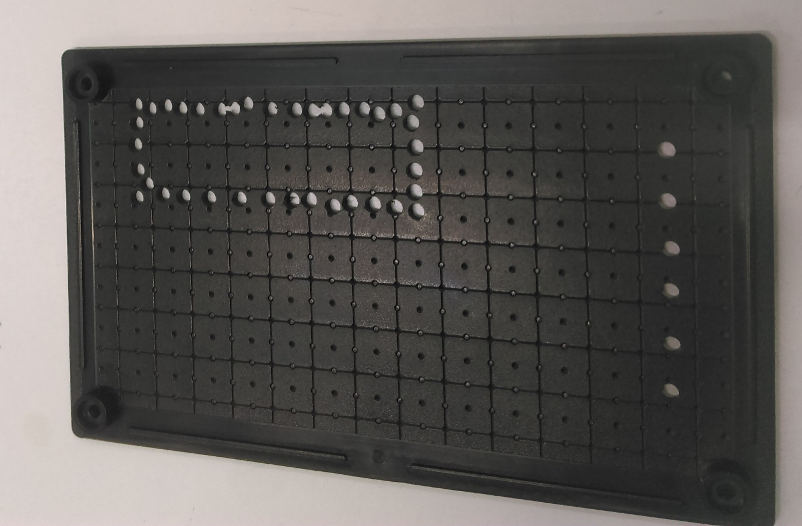

You can then cut out the shape easier with a pair of side-cutters, and file the shape to be the correct size and dimensions.

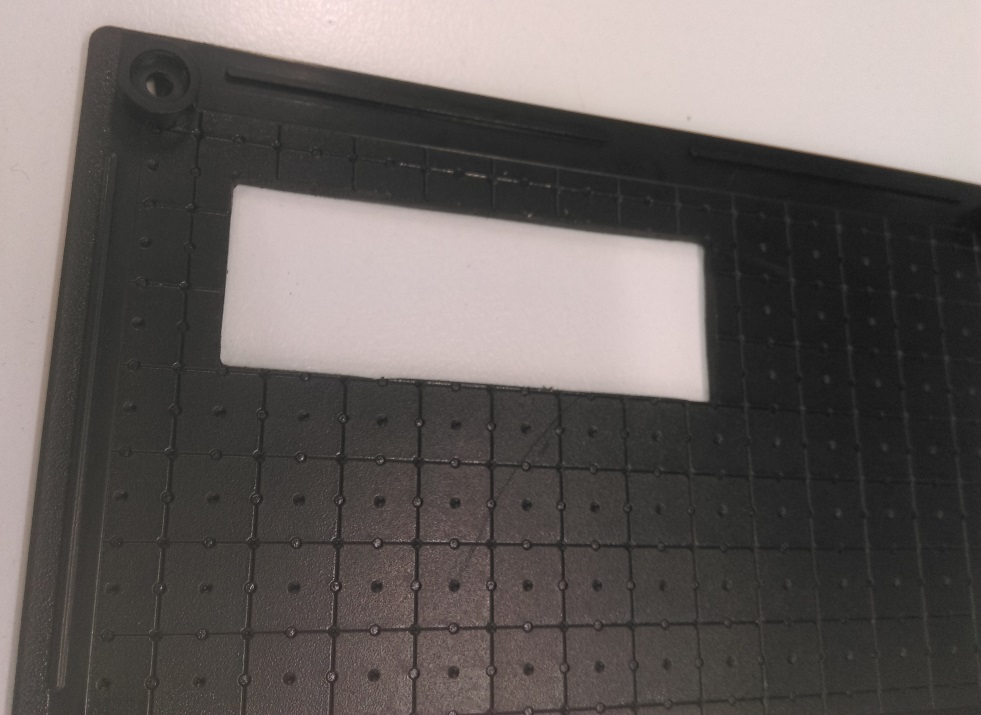

Once the LCD fits in snuggly, you can position the terminals by using a pencil or drillbit to mark where each of the holes are on the terminal strip.

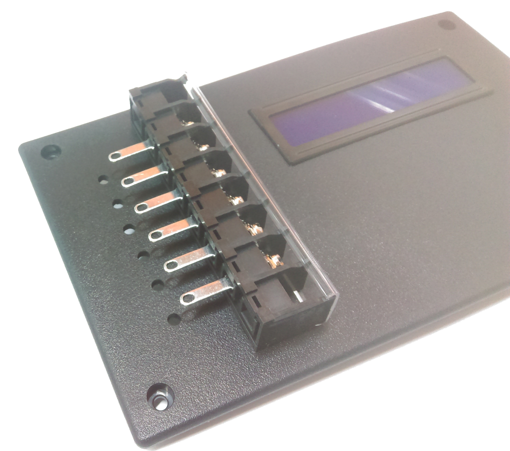

You'll find that this is just under the 10mm square size, so unfortunately, it will not line up. Use a 3mm drill bit to allow enough room for the terminals to slide in, and once they're in you're free to use hot-glue to hold them in place.

The next task is to lay out the panel a bit; we are going to place the regulator and relay on the lid, so position them to get an understanding of where things are going.

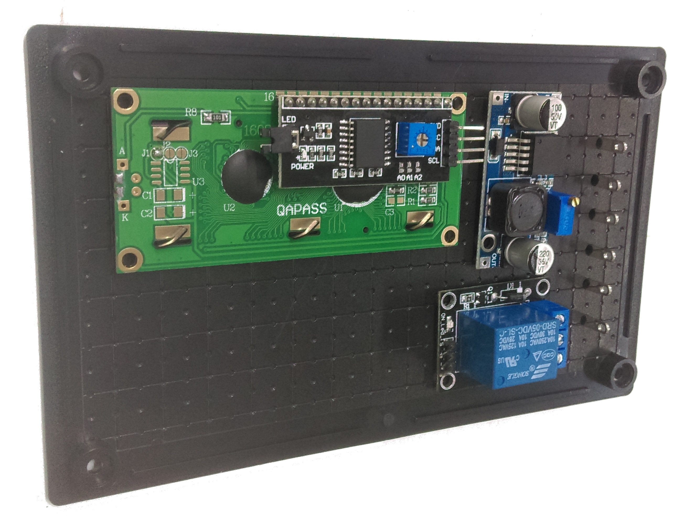

Positioning them like this gives us room to put the encoder wherever we want under the LCD screen, it might be easier to first solder a length of wire to the encoder first, so that you won't have to undo it later.

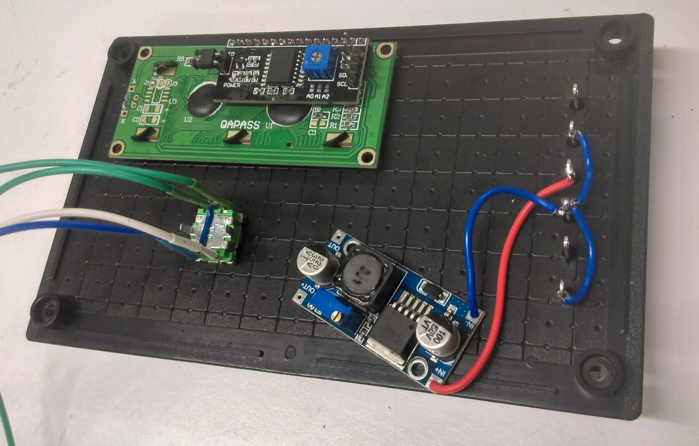

Here we're starting to join some of the terminals together, the bottom terminal of each pair is all ground, so we'll link them up.

Make sure to measure the voltage coming off the voltage regulator when you connect it up. It will regulate from any voltage down to the voltage you specify, so just attach a simple 9V battery or otherwise to it to begin with, then adjust counter-clockwise to the voltage that you require.

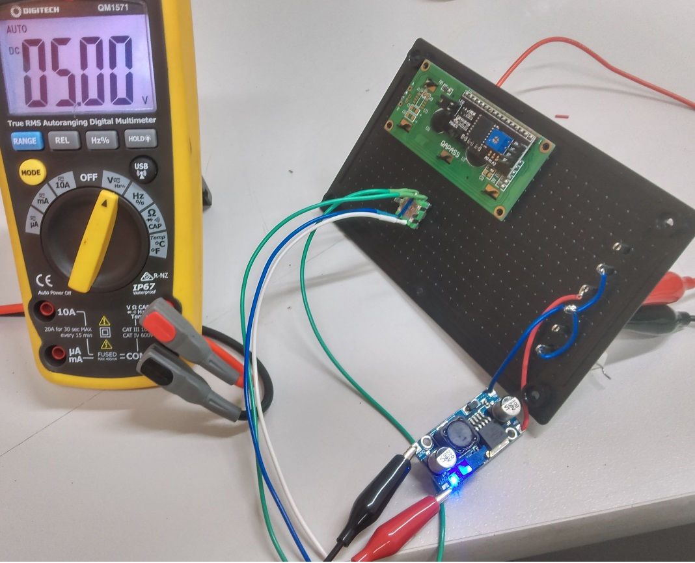

### Circuit board layout

The layout of the circuit is as below. Note the inclusion of 5k between D3 and BJT Base

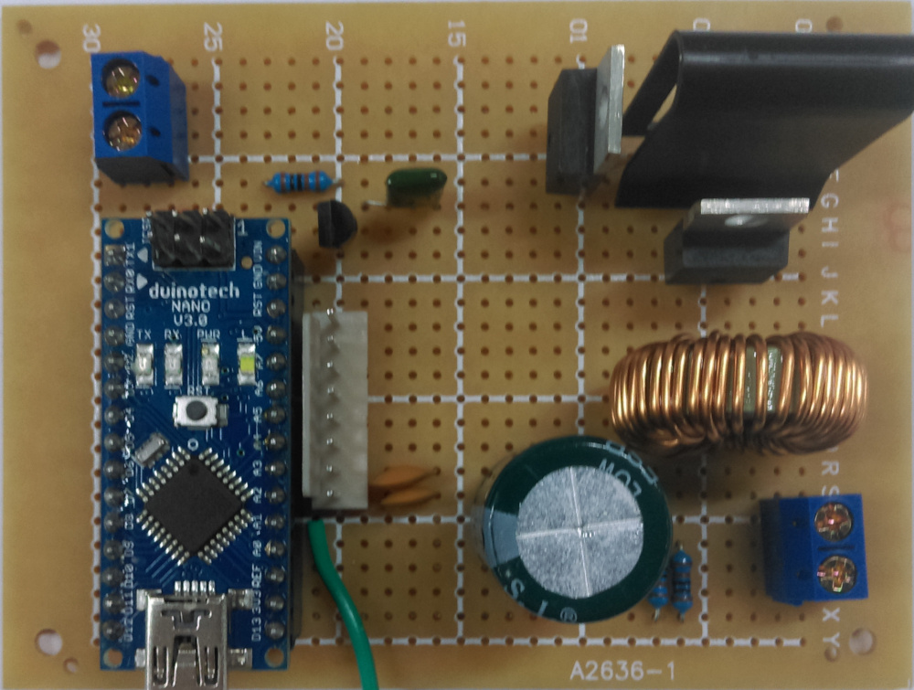

To make it easier to follow, we've highlighted the underside of the board to show the connections easier and where each of the components are; you can see the annotations showing what each component is.

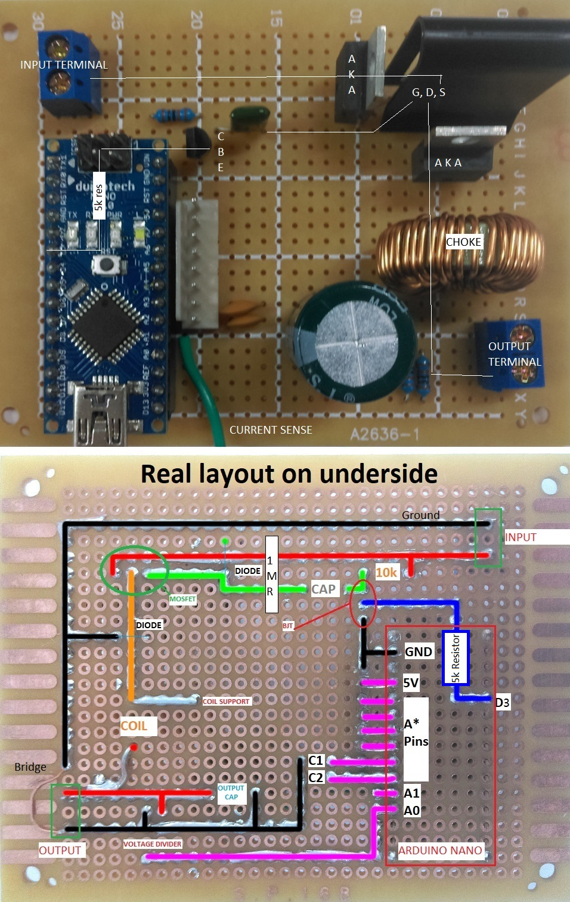

- From the input terminal (above the NANO) the solar panel voltage goes through to the `SOURCE of the mosfet.
- 10k resistor used from `INPUT+` into BJT Collector
- Nano `D3` to BJT transistor, through a 5k (or parallel 10k ) resistor. The BJT then connects through the green capacitor to the Gate;
- Drain flows downard, through the coil
- Coil has one of the legs going sideways to act as a soldered support, it is not important.
- From the coil to the output terminal, with the output cap sitting across the positive and negative of the output.
- There is a small bridge between the source ground and output ground; This was just due to board space and layout; an alternative would be to bring the negative rail under the coil and connect near `C1`/`C2`.

The header connector sits very comfortably next to the arduino Nano along the `A2`-`RST` pins; however we do not need the reset, we need ground instead, so connect that across.

Here we have used some multi coloured wire to highlight the different positions for the connector; it should start to make sense now.

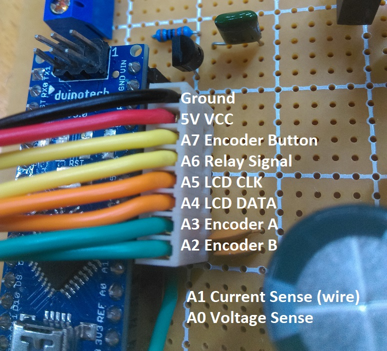

Finally, connect the connector to the LCD, relay, regulator, and encoder.

**Important! Make sure the regulator is set to 5V before connecting it to any device!**

Here is a complete system diagram of how it is meant to be set up.

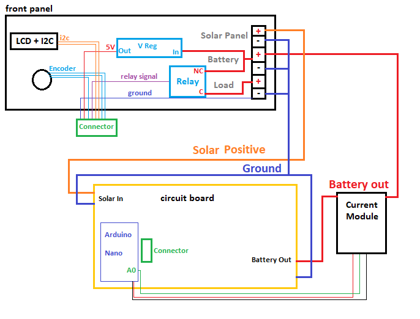

Make sure nothing is bridging before you connect it to real power! Complex circuits like this can easily become a mess, so make sure you use your multimeter on continuity mode to test between different connection points to see what is touching when it shouldn't, and what isn't touching when it should.

Disconnect the Nano, then put a 12v source on the battery terminals; is there correctly 5v going to where it needs to go? Make sure the voltage regulator is set properly.

## Program

The only library needed for this project is the LiquidCrystal for the I2C module, and the timerOne library for the PWM signal.

| Library               | Author             | Version |
| --------------------- | ------------------ | ------- |
| LiquidCrystal_PCF8574 | Matthias Hertel    | 1.2.0   |
| TimerOne              | Jesse Tane, et. al | 1.1.0   |

Simply install the libraries then press upload.

## Use

Connect a solar panel to the Solar panel terminals on your device ( if you followed our instructions, it would be the topmost, while looking at the front of the control panel.) Then connect a battery on the battery terminals ( middle, from our instructions) You should see the system come to life and start to give you information; Naturally it will automatically start to monitor the power going into and out from your battery; so when you connect a load it can tell you how much strain there is.

### Need more info

Do you have a request for clarification, Think you've spotted a mistake, or have a better way of doing things? Let us know on the Github Issues tab, and get your own code in as part of the action

<https://github.com/Jaycar-Electronics/Solar-MPPT-Charge-Controller/issues>
